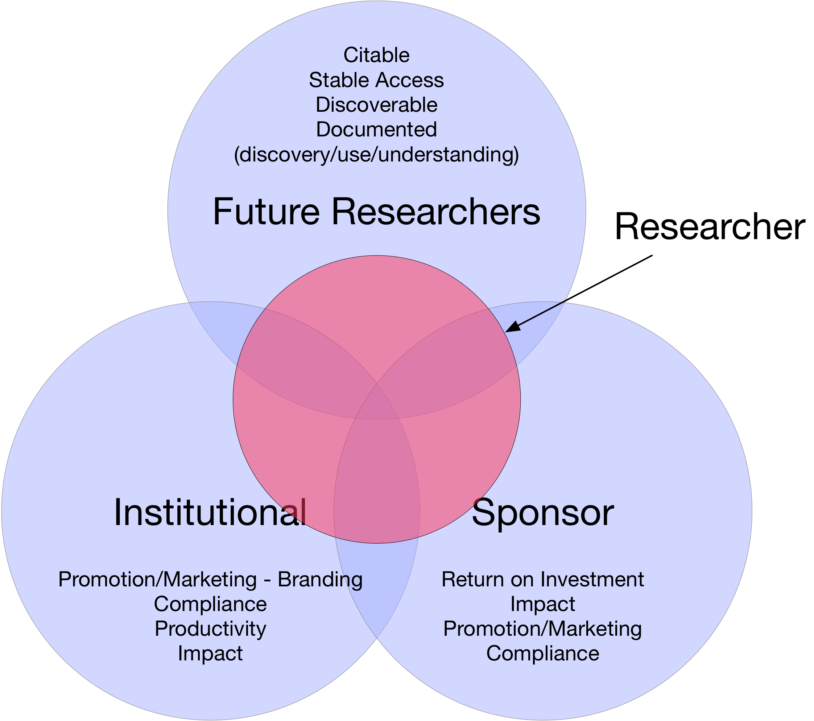

---
title: Where Can I Find & Share Data?
author:
  - Jonathan Wheeler^[UNM Research Data Services, jwheel01@unm.edu]
  - Karl Benedict^[UNM Research Data Services, kbene@unm.edu]
margin-left: 1in
margin-right: 1in
margin-top: .5in
margin-bottom: .5in
...

Repositories of various types are increasingly important in the preservation, discovery, access, and reuse of research data. This workshop is focused on fostering a discussion around the various interests that are in play in the development, use, and selection of specific repositories - both as sources for discovering and accessing data for reuse, but also for sharing and preservation of research project products. 

# Repositories: Open Data Infrastructure

## Open Data: Why?

Policies and drivers include federal and other funder requirements:

* White House Office of Science and Technology Policy memo, [_Expanding Public Access to the Results of Federally Funded Research_](https://obamawhitehouse.archives.gov/blog/2013/02/22/expanding-public-access-results-federally-funded-research)[^OSTP]
* [Gates Foundation Open Access Policy](https://www.gatesfoundation.org/how-we-work/general-information/open-access-policy)[^Gates]

The list goes on - NSF, NIH, DoE, DoD...

Policy (sticks) aside, there is likewise research into the cultural, scientific, and social benefits of making data open and reusable (carrots). The [Fair Guiding Principles](https://www.nature.com/articles/sdata201618)[^FAIR] provide a nice overview as well as a pretty useful acronym of what _open_ means regarding data:

**F**indable
**A**ccessible
**I**nteroperable
**R**eusable

We note the NSF is currently funding projects around research and data re-use.

## Classes of Repositories

Repositories may be categorized in a number of different ways, depending upon needs:

Compliance with standards that define trustworthyness,  measures of reliability, or other predefined characteristics, such as the

  * [Trusted Digital Repository (TDR) Checklist](http://www.crl.edu/sites/default/files/d6/attachments/pages/trac_0.pdf)[^TDR], or its successor 
  * Trustworthy Digital Repositories - [ISO 16363](https://www.iso.org/standard/56510.html)[^ISO]/[CCSDS 652.0-M-1](https://public.ccsds.org/pubs/652x0m1.pdf)[^CCSDS]
  * [Data Seal of Approval](https://www.datasealofapproval.org/en/)[^DSA]

{width=3.5in}

Types of content that those repositories focus on:

* **Disciplinary repositories** that specialize in content produced by specific research disciplines such as [ICPSR](https://www.icpsr.umich.edu/icpsrweb/landing.jsp)[^ICPSR] for social science data, the [Archaeology Data Service](http://archaeologydataservice.ac.uk/)[^ADS] for archaeological data, and [GenBank](http://www.ncbi.nlm.nih.gov/genbank/)[^GenBank] for genetic sequence data. 
* **General or Interdisciplinary repositories** that contain content that cross disciplinary boundaries, and may also contain multiple types of content including data, documents, and multi-media files. 

Or, the organizations that host/manage the repositories - frequently as a designated repository for data products produced by or with funds from those organizations. For example:

* [Data.gov](https://catalog.data.gov/dataset)[^DataGov] - the discovery portal for data generated and provided by US Federal Government agencies, and some states, municipalities, and universities
* NASA's [Distributed Active Archive Centers (DAACS)](https://earthdata.nasa.gov/about/daacs)[^DAAC] - the 12 distributed data centers supported by NASA that provide discovery and access to different thematic collections of Earth science data. 
* UNM's [digital repository](http://digitalrepository.unm.edu)[^Lobo] - the designated *institutional repository* for the University of New Mexico.  

## Open Data: Where?

Requirements for repository services will vary from case to case, and there is no one-size-fits-all solution. Relevant factors include:

* Trusted repository status
* Capacity and commitment to preservation
* Provision of permanent identifiers (DOI)
* Format support
* Federation, discovery, and interoperability with other systems

Often these and other repository characteristics and policies are documented. Resources for identifying and assessing repositories include:

* PLOS ONE Data Availability policy (includes a [list of recommended repositories](http://journals.plos.org/plosone/s/data-availability)[^PLOS])
* Nature Scientific Data [Recommended Data Repositories](https://www.nature.com/sdata/policies/repositories)[^NATURE]
* Scientific Data [recommended repositories](https://figshare.com/articles/Scientific_Data_recommended_repositories_June_2015/1434640)[^SciData]
* Registry of Research Data Repositories [(re3data.org)](https://www.re3data.org/)[^RE3DATA]

## A Synthesis

{width=3.5in}

---------------------

| Download this document: [https://unmrds.github.io/bb-discovery/bb-discovery.pdf](https://unmrds.github.io/bb-security/bb-discovery.pdf)
| Github Repository: [https://github.com/unmrds/bb-discovery](https://github.com/unmrds/bb-discovery)

---------------------

| 
| This work is licensed under a [Creative Commons Attribution 4.0 International License](http://creativecommons.org/licenses/by/4.0/)

[^TDR]: RLG-NARA Task Force on Digital Repository and Certification (2007). *Trustworthy Repositories Audit & Certification: Criteria and Checklist*. Version 1, February 2007. Robin L. Dale and Bruce Ambacher, ed. The Center for Research Libraries & OCLC Online Computer Library Center, Inc. [http://www.crl.edu/sites/default/files/d6/attachments/pages/trac_0.pdf](http://www.crl.edu/sites/default/files/d6/attachments/pages/trac_0.pdf)

[^ISO]: International Organization for Standardization (ISO) (2012). *ISO 16363:2012 (CCSDS 652.0-R-1)
Space data and information transfer systems -- Audit and certification of trustworthy digital repositories*. [https://www.iso.org/standard/56510.html](https://www.iso.org/standard/56510.html)

[^CCSDS]: The Consultative Committee for Space Data Systems (2011). *Audit and Certification of Trustworthy Digital Repositories Recommended Practice* CCSCS 652.0-M-1. [https://public.ccsds.org/pubs/652x0m1.pdf](https://public.ccsds.org/pubs/652x0m1.pdf)

[^DSA]: Data Seal of Approval website (2018). [https://www.datasealofapproval.org/en/](https://www.datasealofapproval.org/en/)

[^ICPSR]: Inter-University Consortium for Political and Social Research (ICPSR). [https://www.icpsr.umich.edu/icpsrweb/landing.jsp](https://www.icpsr.umich.edu/icpsrweb/landing.jsp)

[^ADS]: Archaeology Data Service (ADS). [http://archaeologydataservice.ac.uk/](http://archaeologydataservice.ac.uk/)

[^GenBank]: GenBank. [http://www.ncbi.nlm.nih.gov/genbank/](http://www.ncbi.nlm.nih.gov/genbank/)

[^OSTP]: White House Office of Science and Technology Policy (OTSP) (2013). *Expanding Public Access to the Results of Federally Funded Research.* [https://obamawhitehouse.archives.gov/blog/2013/02/22/expanding-public-access-results-federally-funded-research](https://obamawhitehouse.archives.gov/blog/2013/02/22/expanding-public-access-results-federally-funded-research)

[^Gates]: Bill and Melinda Gates Foundation. *Open Access Policy*. [https://www.gatesfoundation.org/how-we-work/general-information/open-access-policy](https://www.gatesfoundation.org/how-we-work/general-information/open-access-policy)

[^FAIR]: Nature Scientific Data (2016). The FAIR Guiding Principles for scientific data management and stewardship. [https://www.nature.com/articles/sdata201618](https://www.nature.com/articles/sdata201618)

[^PLOS]: PLOS ONE (2014). *Data Availability.* [http://journals.plos.org/plosone/s/data-availability](http://journals.plos.org/plosone/s/data-availability)

[^NATURE]: Nature Scientific Data (2018). *Recommended Data Repositories.* [https://www.nature.com/sdata/policies/repositories](https://www.nature.com/sdata/policies/repositories)

[^SciData]: Scientific Data (2018). *Scientific Data Recommended Repositories.* [doi:10.6084/m9.figshare.1434640.v11](https://figshare.com/articles/Scientific_Data_recommended_repositories_June_2015/1434640)

[^RE3DATA]: Registry of Research Data Repositories (2018). [https://www.re3data.org/](https://www.re3data.org/)

[^DataGov]: Data.gov (2018). [https://catalog.data.gov/dataset](https://catalog.data.gov/dataset)

[^DAAC]: NASA Distributed Active Archive Centers (DAACS) (2018). [https://earthdata.nasa.gov/about/daacs](https://earthdata.nasa.gov/about/daacs)

[^Lobo]: UNM's Institutional Repository (2018). [http://digitalrepository.unm.edu](http://digitalrepository.unm.edu)

------------------------------------

# Further Reading

* Baker, Karen S., and Lynn Yarmey. "Data Stewardship: Environmental Data Curation and a Web-of-Repositories." _International Journal of Digital Curation_ 4, no. 2 (2009): 12-27. https://doi.org/10.2218/ijdc.v4i2.90
* Beagrie, Neil, and John Houghton. "The Value and Impact of Data Sharing and Curation: A Synthesis of Three Recent Studies of UK Research Data Centres." London: JISC, 2014. http://repository.jisc.ac.uk/5568/1/iDF308_-_Digital_Infrastructure_Directions_Report%2C_Jan14_v1-04.pdf
